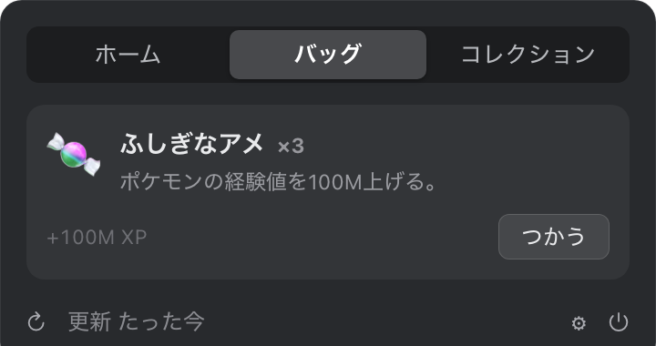
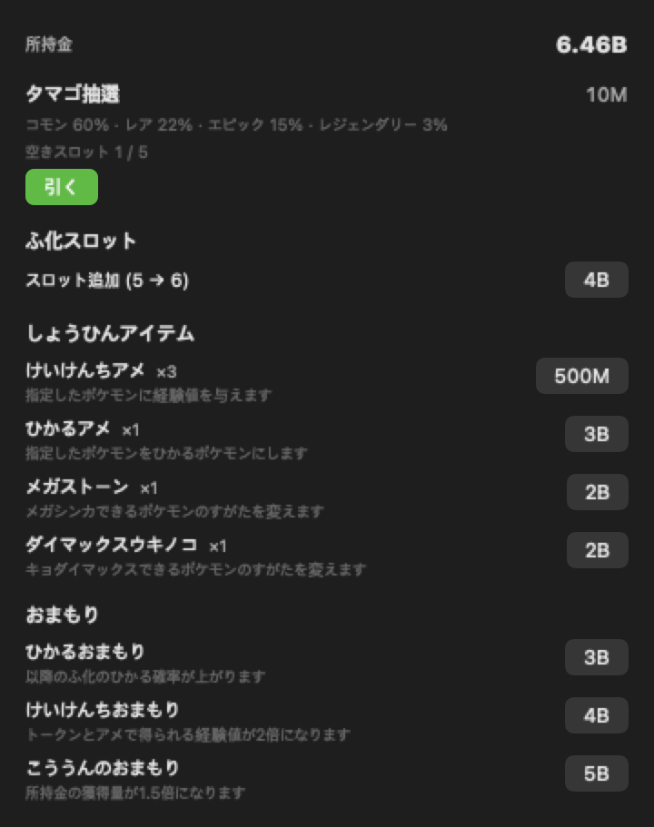

<div align="center">


# PokeDexBar

**あなたのAIコーディングトークンを、ポケモンに — メニューバーで。**

[](https://github.com/leedg0831/PokeDexBar/releases)
[](https://www.apple.com/macos/)
[](https://swift.org)
[](#homebrew)
[](LICENSE)
[](https://github.com/sponsors/leedg0831)

[English](README.md) · [한국어](README.ko.md) · **日本語**

</div>

> **[PokeTokenBar](https://github.com/chattymin/PokeTokenBar) のフォーク**（MIT, © chattymin）。
> PokeDexBar はスプライトソースを [Pokémon Showdown](https://play.pokemonshowdown.com/sprites/) に切り替え、
> 第9世代まですべての世代に対応し、スプライトに EPX アンチエイリアシングを追加します。

PokeDexBar は、あなたがすでに使っている AI コーディングトークン（Claude Code・Codex・Gemini CLI・OpenCode・Hermes Agent・Cursor・Grok CLI）を、macOS メニューバーの中の **ポケモン経済** に変えます。最初にパートナーを選ぶと、そこから使うトークンがそのまま通貨になります — 通貨でタマゴを引き、リアルタイムで孵化していくのを見守り、パートナーが経験値を貯めたら自分の手で進化させましょう。ゲームの下には正確な使用量トラッカーがあります — 今日の使用量・コスト、公式の5時間／週間上限をローカルログから直接読み取ります。

> トークン使用量はローカルの Claude Code・Codex・Gemini CLI・OpenCode・Hermes Agent・Cursor・Grok CLI データから直接読み取ります（`totalTokens` = input + output + cache、ローカル日付）— 外部 CLI 不要。非公式・非商用のポケモンファンプロジェクトです — [ライセンス & 免責](#ライセンス--免責) を参照。

## なぜ

- **開くのが楽しい使用量トラッカー。** 使用量がタマゴ抽選の通貨になり、図鑑を埋め、個体でいっぱいのボックスを育てます。色違い1匹が、また開く理由になります。
- 今日のトークン使用量とコストを一目で — ダッシュボードもブラウザタブも不要。
- 公式の **5時間 / 週間** 上限をリセットのカウントダウンとともに追跡し、現在の burn rate でいつ到達するかを予測します。

<div align="center">

</div>

## しくみ

1. 🎮 **パートナーを選ぶ。** 初回起動時、第1〜9世代の進化前ポケモン27匹から1匹を選びます（色違いはありません）— それがあなたのパートナーになります。
2. 🪙 **いつも通りコーディング。** Claude Code・Codex・Gemini CLI・OpenCode・Hermes Agent・Cursor・Grok CLI で使うトークンがそのまま通貨になり、同時にパートナーの経験値も増えます — 追加の操作は不要です。
3. 🥚 **タマゴを引く。** **ショップ**で通貨を払うと、等級がランダムに決まったタマゴがもらえます — コモン55%・レア15%・エピック25%・レジェンダリー5%、選ぶことはできません。最大3個まで同時に温められ、スロットを買えば6個まで拡張できます。
4. 🐣 **リアルタイムで孵化。** コモンは30分、レアは2時間、エピックは6時間、レジェンダリーは24時間 — アプリを閉じていても進む実時間です。タマゴは [PokéAPI](https://pokeapi.co/) の実際の進化データを持つ進化前（ベース）の種だけが生まれ、25種類のせいかくがひとつ決まり — ごくまれな偶然で **✨ 色違い** が生まれます。リージョンフォームを持つ種は20%の確率でアローラ・ガラル・ヒスイ・パルデアの姿で生まれ、その個体は一生その姿のままです。
5. ⚡ **自分の手で進化させる。** コーディング（またはショップの経験値アメ）で経験値を貯め、準備ができたらタップして進化させましょう — 分岐する進化ラインは自分で行き先を選べます。リージョンフォームは進化先も変えます — ガラルのニャースはニャイキングに、カントーのニャースはペルシアンに進化します。
6. 📖 **ふたつのコレクションを埋める。** **図鑑** はこれまでに孵化させたすべての種を1番から1025番まで記録します（未発見はシルエット）。**ボックス** は持っているすべての個体をグリッドで表示します — マス目ごとにパートナー・色違い・進化可能かがひと目でわかり、タップすると詳細画面でパートナー設定・アメを与える・進化・フォーム変更がすべてできます。重複はごく普通のことで、個体ごとに経験値と進化状態を別々に持つので、コイキングとギャラドスを同時に持つこともできます。

## ツアー

<table>
<tr>
<td width="45%" align="center"></td>
<td width="55%" valign="middle">
<h3>🐾 デスクトップに置く</h3>
パートナーをメニューバーからデスクトップへ、48〜192px の好きなサイズで。ホバーで今日の使用量、クリックでポップオーバー、右クリックでメニュー、ドラッグで自由に移動 — 上限アラートはペットの上に吹き出しでも表示されます。
</td>
</tr>
<tr>
<td width="55%" valign="middle">
<h3>メニューバーの相棒</h3>
動く Gen-V スプライトが今日のトークン合計（compact、例：<code>200.7M</code>）の隣に住んでいます。今日のコスト（<code>$</code>）や公式上限 <code>%</code> を追加しても、すべてオフにしてキャラクターだけにしても。
</td>
<td width="45%" align="center"></td>
</tr>
<tr>
<td width="45%" align="center"></td>
<td width="55%" valign="middle">
<h3>✨ ごくまれな偶然、色違い</h3>
色違いはメニューバー・ホームカード・進化ライン・ボックスのどこでも専用カラーで表示され、進化しても維持されます。専用通知でその瞬間を見逃しません。
</td>
</tr>
<tr>
<td width="55%" valign="middle">
<h3>図鑑とボックス、ふたつのコレクション</h3>
<b>図鑑</b>は1番から1025番までの種チェックリストです — 孵化させるまではシルエットのまま。<b>ボックス</b>は孵化・進化させたすべての個体をグリッドで表示します — マス目ごとにパートナー・色違い・進化可能かがひと目でわかり、タップすると等級・せいかく・捕獲日・経験値に加え、パートナー設定・アメを与える・進化・フォーム変更のボタンがある詳細画面が開きます。重複はごく普通のことです。
</td>
<td width="45%" align="center"></td>
</tr>
<tr>
<td width="45%" align="center"></td>
<td width="55%" valign="middle">
<h3>設定はお好みで</h3>
メニューバー表示項目、更新間隔（1–15分／手動）、ログイン時に起動、上限セクションだけを隠す Keychain オフ、警告／危険の閾値つき上限通知、孵化・進化の通知。<b>韓国語／英語／日本語</b>の UI とポケモン名を完備。
</td>
</tr>
<tr>
<td width="55%" valign="middle">
<h3>🥚 タマゴは自分ではなく時計が孵す</h3>
最大3個（スロットを買えば6個）まで同時に引くと、それぞれが実時間のタイマーで孵化します — コモンは30分、レジェンダリーは24時間まで。席を外していてもホームでリアルタイムにカウントダウンされ、まとまって準備できると通知がひとつ届きます。
</td>
<td width="45%" align="center"></td>
</tr>
<tr>
<td width="45%" align="center"></td>
<td width="55%" valign="middle">
<h3>🛒 経済のためのショップ</h3>
これまで使ったトークンがそのまま通貨です — ボタンに表示された確率どおりの価格でタマゴを引き、ふ化スロットを3個から6個まで拡張し、<b>けいけんちアメ</b> でポケモンを育てたり <b>ひかるアメ</b> でそのまま色違いにしたり、孵化の色違い確率を1/64から1/48へ永続的に上げる <b>光るお守り</b> を購入できます。個体の詳細画面から <b>メガストーン</b> や <b>ダイマックスたけ</b> を使うと、80種類のフォームのひとつに姿を変えられます。
</td>
</tr>
</table>

## そのほかにも

- **インタラクティブなフローティングペット** — ホバーで今日の使用量、クリックでメイン画面、右クリックでメニュー。上限アラートは吹き出しでも表示。
- **サービス別タブ** — Claude Code・Codex・Gemini CLI・OpenCode・Hermes Agent・Cursor・Grok CLI のうち2つ以上が検出されると、小さなタブでサービス別の詳細を切替（今日の合計は合算のまま）。
- **公式の上限** — Claude・Codex の5時間／週間使用率とリセットのカウントダウンを、今日の数字のすぐ下に。
- **消費予測** — 現在の5時間ウィンドウが100%に達する時刻を予測。
- **アプリ内アップデート** — ワンクリックの更新確認、設定に現在のバージョンを表示。
- **メガシンカ & キョダイマックス** — メガストーンやダイマックスたけで、指定したポケモンを80種類のフォームのひとつに変えます（リザードンのようにメガフォームが2つある種はX/Y両方を用意）。元の姿に戻すのは無料で、進化するとフォームは解除されます。
- **リージョンフォーム** — アローラ・ガラル・ヒスイ・パルデアの姿は該当する種が孵化する際に20%の確率で現れ、その個体は一生その姿のままで、進化先が変わることもあります。メガシンカ・キョダイマックスはリージョンフォームには使えません。
- **セーブの整合性チェック** — セーブファイルを直接編集しても止められはしませんが、検知されます — セーブに改ざんの印が永久に残り、すべてのスプライトが上下逆さまに表示されますが、進行状況が失われることはありません。

## 対応ツール

| ツール | 集計範囲 | 公式の上限 |
|---|---|---|
| **Claude Code** | 今日 · 5時間ブロック · 週 · 月 | ✅ 5時間／週間 |
| **Codex** | 今日 · 週 · 月 | ✅ 5時間／週間 |
| **Gemini CLI** | 今日 · 週 · 月 | — |
| **OpenCode** | 今日 · 5時間ブロック · 週 · 月 | — |
| **Hermes Agent** | 今日 · 5時間ブロック · 週 · 月 | — |
| **Cursor** | 今日 · 5時間ブロック · 週 · 月 | — |
| **Grok CLI** | 今日 · 5時間ブロック · 週 · 月 | — |

すべてローカルから読み取り — 外部の使用量CLIは不要。ツール追加はプロバイダーファイル1つで完結します（[CONTRIBUTING.ja.md](CONTRIBUTING.ja.md) 参照）。

## インストール

### 必要条件

macOS 14+（Apple Silicon または Intel）。それだけ — トークン使用量はローカルの Claude Code・Codex・Gemini CLI・OpenCode・Hermes Agent・Cursor・Grok CLI データから直接読み取り、外部の使用量 CLI は不要です。

### Homebrew

```bash
brew install --cask leedg0831/tap/poke-dex-bar
```

ad-hoc／自己署名アプリのため、Cask インストール時に隔離属性を自動で除去します。

### 手動インストール（Homebrew なし）

Homebrew を使わない場合は、[最新リリース](https://github.com/leedg0831/PokeDexBar/releases/latest) から `PokeDexBar.zip` をダウンロードして展開し、`PokeDexBar.app` を `/Applications` にドラッグします。

このアプリは ad-hoc／自己署名（Apple Developer アカウントでの公証なし）のため、初回起動時に Gatekeeper が「開発元が未確認」の警告を表示します。次のいずれかで一度だけ解除してください。

- **Finder:** `PokeDexBar.app` を右クリック（または Control+クリック）→ **開く** → ダイアログで再度 **開く**。
- **ターミナル:** `xattr -dr com.apple.quarantine /Applications/PokeDexBar.app`

（Homebrew Cask は隔離属性を自動で除去するため、この手順は不要です。）

### ソースからビルド

```bash
swift build                  # デバッグ
swift test                   # ユニットテスト
./scripts/build-app.sh       # release → PokeDexBar.app → /Applications
```

## データソース

| ソース | 用途 | 備考 |
|---|---|---|
| `~/.claude/projects/**/*.jsonl` | Claude Code daily/blocks/weekly/monthly | 直接読み取り；メッセージ id で重複排除；増分キャッシュ |
| `~/.gemini/tmp/**/chats/*.json(l)` | Gemini CLI daily/monthly | セッションレコード（メッセージ別 `tokens`）；週間 = daily 合算 |
| `~/.codex/sessions/**/*.jsonl` | Codex daily/monthly | `token_count` イベント；週間 = daily 合算 |
| `~/.local/share/opencode/opencode.db` | OpenCode daily/blocks/weekly/monthly | SQLite 読み取り専用；レガシー `storage/message` JSON にも対応 |
| `~/.hermes/state.db` | Hermes Agent daily/blocks/weekly/monthly | SQLite 読み取り専用；セッショントークン合計と保存済みコスト |
| `~/Library/Application Support/Cursor/User/globalStorage/state.vscdb` | Cursor daily/blocks/weekly/monthly | SQLite 読み取り専用；`cursorDiskKV` バブルエントリの `tokenCount` |
| `~/.grok/sessions/**/updates.jsonl` | Grok CLI daily/blocks/weekly/monthly | `turn_completed` レコード（ターン単位の `usage`、サーバー報告のコスト）；`$GROK_HOME` を設定していればそのパス；サブエージェントのセッションは親ターンに合算済みのため除外 |
| Keychain / `~/.claude/.credentials.json` → `api.anthropic.com` | Claude 公式 5h/週間 % | 非公式 endpoint；Keychain は**更新ボタンを押した時のみ**読み取り — 自動更新では読みません |
| `codex app-server` | Codex 公式 5h/週間 % | ローカル子プロセス；アカウント snapshot のみ、モデル turn なし |
| [PokéAPI](https://pokeapi.co/) — `pokeapi.co`, `graphql.pokeapi.co` | ポケモンの種・進化データ | ランタイム取得；ローカルキャッシュ、バンドルしない |
| [Pokémon Showdown](https://play.pokemonshowdown.com/sprites/) — `play.pokemonshowdown.com` | ポケモンのスプライト（静止画・アニメーション、色違い、全世代） | ランタイム取得；Application Support にキャッシュ、バンドルしない |
| `raw.githubusercontent.com/PokeAPI/sprites` | アイテム・タマゴのスプライト | ランタイム取得；Application Support にキャッシュ、バンドルしない |
| `status.claude.com`, `status.openai.com` | プロバイダ障害バナー | statuspage の要約；表示専用 — 設定でオフにできます |
| `api.github.com` | アップデート確認 | 最新リリースのタグ；起動時とポップオーバーを開いた時 |

## プライバシー & 権限

- **オンデバイス。** トークン使用量はローカルの Claude Code・Codex・Gemini CLI・OpenCode・Hermes Agent・Cursor・Grok CLI データから直接読み取ります。使用量のアップロードやモデル turn の実行は行いません。
- **外部リクエスト。** 本アプリは完全オフラインではありません。8つのホストに接続します — `pokeapi.co`・`graphql.pokeapi.co`（種・進化データ）、`play.pokemonshowdown.com`（ポケモンのスプライト）、`raw.githubusercontent.com`（アイテム・タマゴのスプライト）、`api.anthropic.com`（Claude 公式の上限）、`status.claude.com`・`status.openai.com`（障害バナー — 設定でオフ可）、`api.github.com`（アップデート確認）。**いずれのリクエストにも使用量・トークン・プロンプト・プロジェクトのパスは含まれません** — 送られるのはリクエストそのものだけです。
- **Keychain（任意）。** Claude OAuth 資格情報は**更新ボタンを押した時のみ**読み取ります（設定、またはポップオーバーの上限行）。自動更新では Keychain に触れないためパスワードのプロンプトは表示されず、`~/.claude/.credentials.json` があればそちらから取得します。トークンはメモリ上にのみ保持し、**アプリ自身の Keychain 項目は作成しません。** トークンが期限切れになると、上限は更新するまで以前の値（stale）として表示されます。設定でオフにすると上限セクションが非表示になります。
- **ポケモンのアセット** はランタイムに取得します（種・進化データは PokéAPI、スプライトは Pokémon Showdown から）。`~/Library/Application Support/PokeDexBar/` にのみキャッシュされます。アプリのバイナリおよびリリース成果物にポケモンのアセットは含まれません。

## コントリビューター

大小を問わずあらゆる貢献を歓迎します — ビルド・テスト・プルリクエストの方法は [CONTRIBUTING.ja.md](CONTRIBUTING.ja.md) をご覧ください。

[](https://github.com/leedg0831/PokeDexBar/graphs/contributors)

## ライセンス & 免責

**MIT** — [LICENSE](LICENSE) を参照。MIT は本プロジェクトの**オリジナルソースコードのみ**を対象とし、アプリを通じてアクセスされる第三者の商標・アートワーク・データに関する権利を付与するものではありません。

PokeDexBar は**非公式・非商用のファンプロジェクト**です。**任天堂、ゲームフリーク、クリーチャーズ、株式会社ポケモンとの提携・推奨・後援・承認はありません。**「ポケモン（Pokémon）」および関連する名称・キャラクター・画像は、各権利者の商標および著作物であり、本プロジェクトはポケモンの知的財産に対する所有権や権利を一切主張しません。

- **アプリのバイナリおよびリリース成果物にポケモンのアセットは含まれません。** ポケモンの種・進化データは、公開されている [PokéAPI](https://pokeapi.co) から、スプライトは [Pokémon Showdown](https://play.pokemonshowdown.com/sprites/)(アニメーション・色違い、全世代)から**実行時に**取得され、ユーザーの端末にローカルキャッシュされます。スプライト画像の権利は各権利者に帰属します。
- 本リポジトリのドキュメント（スクリーンショット/GIF）に表示されるポケモンの画像は、アプリの機能を説明する目的でのみ使用されています。
- 本アプリは**個人的・非商用の利用に限り**無償で提供されます。
- 権利者の方で本プロジェクトに懸念がある場合は、Issue を作成するかメンテナーまでご連絡ください。速やかに対応いたします。

*本プロジェクトは、いかなる保証もなく「現状のまま」提供されます。本免責事項は法的助言ではありません。*
