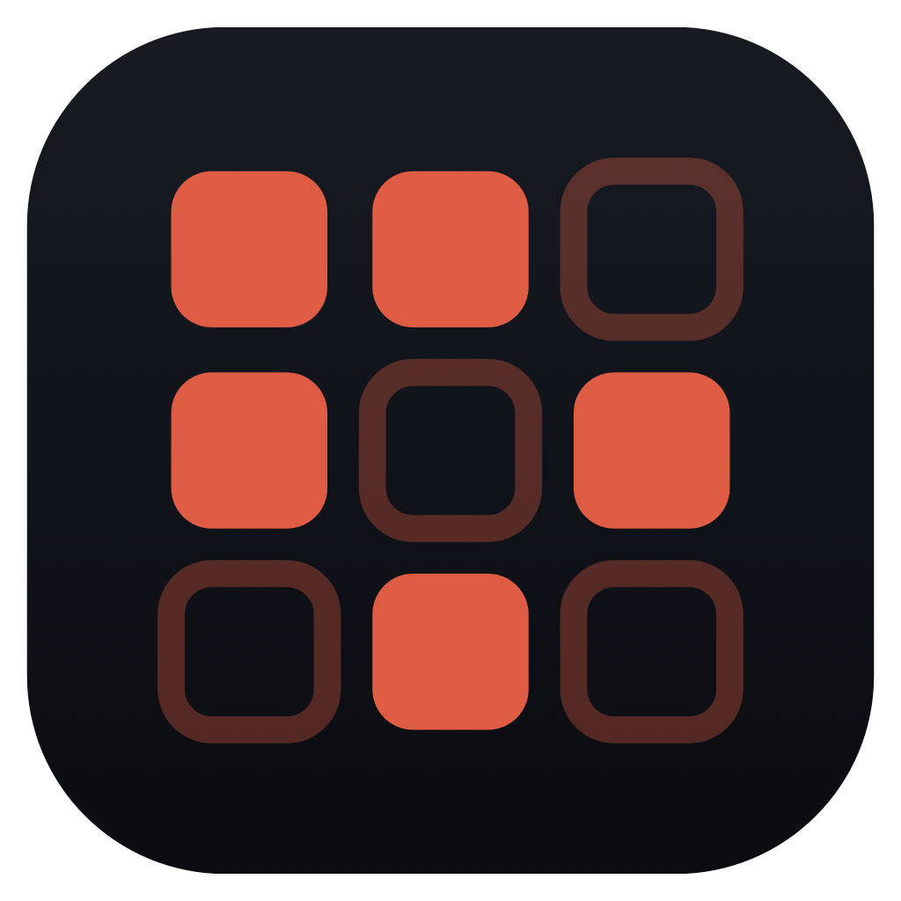
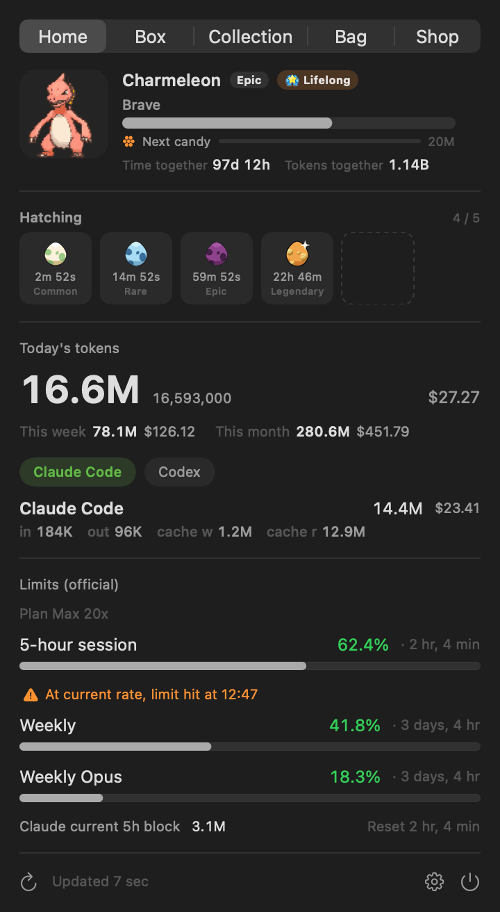
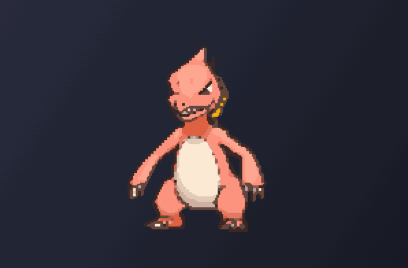
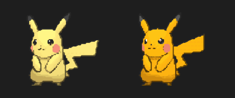
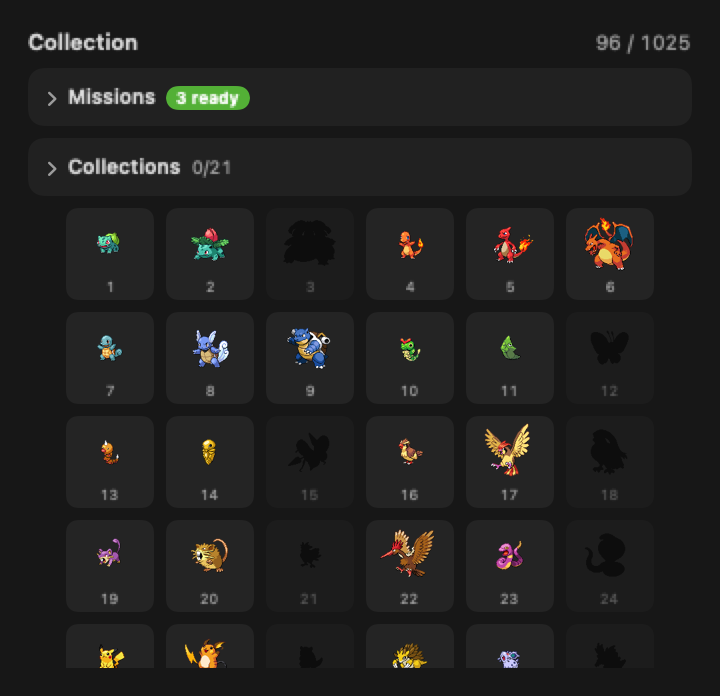
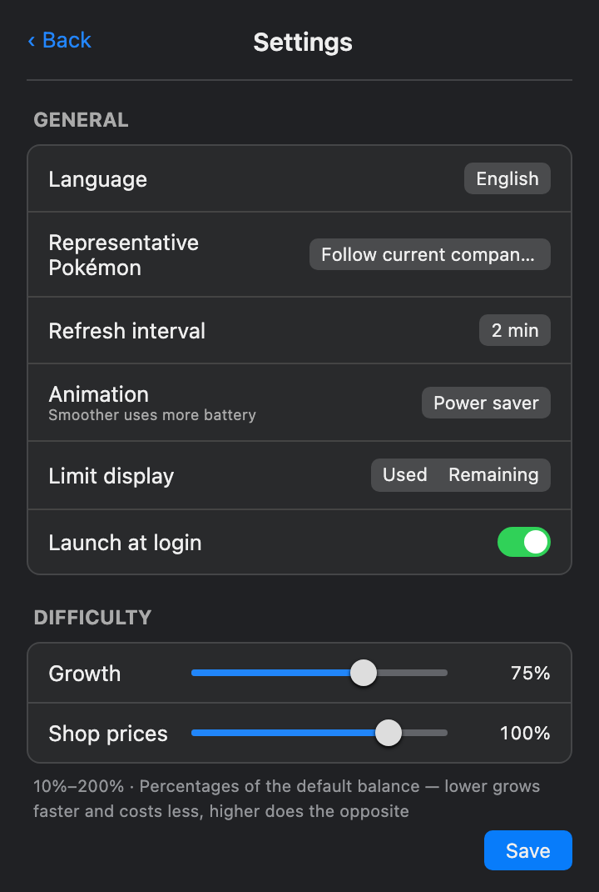
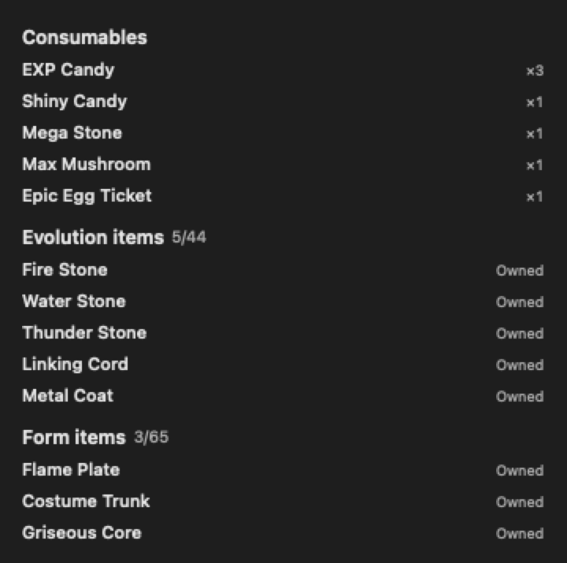
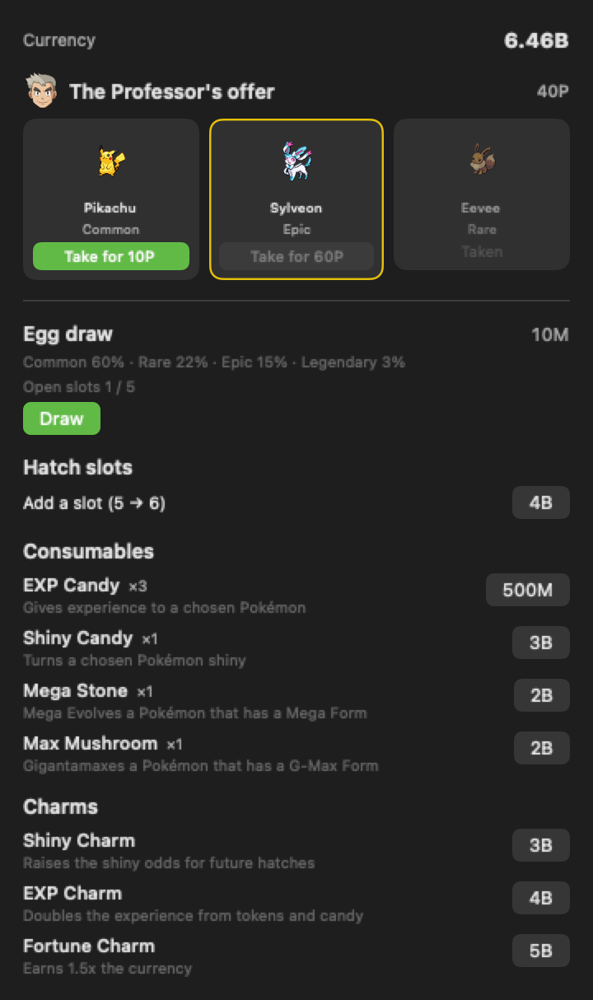

<div align="center">



# PokeDexBar

**Your AI coding tokens, hatched into Pokémon — right in your menu bar.**

[](https://github.com/leedg0831/PokeDexBar/releases)
[](https://www.apple.com/macos/)
[](https://swift.org)
[](#homebrew)
[](LICENSE)
[](https://github.com/sponsors/leedg0831)

**English** · [한국어](README.ko.md) · [日本語](README.ja.md)

</div>

> **A fork of [PokeTokenBar](https://github.com/chattymin/PokeTokenBar)** (MIT, © chattymin).
> PokeDexBar swaps the sprite source to [Pokémon Showdown](https://play.pokemonshowdown.com/sprites/)
> so every generation through Gen 9 is available, and adds EPX anti-aliasing for the sprites.

PokeDexBar turns the AI coding tokens you're already burning — Claude Code, Codex, Gemini CLI, OpenCode, Hermes Agent, Cursor & Grok CLI — into a **Pokémon economy** in your macOS menu bar. Pick a starter, then every token you spend becomes currency: draw eggs with it, watch them hatch on real wall-clock time, and evolve your partner by hand as it earns experience. Underneath the game it's a precise usage tracker — today's spend, cost, and official 5-hour / weekly limits, read straight from your local logs.

> Token usage is read directly from local Claude Code, Codex, Gemini CLI, OpenCode, Hermes Agent, Cursor, and Grok CLI data (`totalTokens` = input + output + cache, local date) — no external CLI needed. Unofficial, non-commercial Pokémon fan project — see [License & disclaimer](#license--disclaimer).

## Why

- **The usage tracker you actually enjoy opening.** Your spend buys egg draws, fills a National Dex, and grows a box full of individual Pokémon — and every shiny is a reason to check back.
- See today's token spend & cost at a glance — no dashboard, no browser tab.
- Track official **5-hour / weekly** limits with reset countdowns and a burn-rate forecast for when you'll hit them.

<div align="center">

</div>

## How it works

1. 🎮 **Pick a starter.** On first launch, choose 1 of 27 first-stage Pokémon spanning Gen 1–9 (never shiny) — it becomes your partner.
2. 🪙 **Code as usual.** The tokens you burn in Claude Code, Codex, Gemini CLI, OpenCode, Hermes Agent, Cursor, or Grok CLI become spendable currency and feed your partner's experience at the same time — nothing extra to run.
3. 🥚 **Draw an egg.** Spend currency in the **Shop** for an egg of a randomly rolled grade — Common 60% / Rare 22% / Epic 15% / Legendary 3%, never chosen. Up to 3 eggs incubate at once, expandable to 6 with a slot upgrade.
4. 🐣 **Hatch on real time.** Commons hatch in 30 minutes, Rares in 2 hours, Epics in 6, Legendaries in 24 — real wall-clock time, even while the app is closed. Every egg hatches a base (unevolved) species with real evolution data from [PokéAPI](https://pokeapi.co/), rolls one of 25 natures, and — once in a rare while — comes out **✨ Shiny**. Species with a regional look have a 20% chance to hatch as their Alolan, Galarian, Hisuian, or Paldean form instead — a look that individual keeps for life.
5. ⚡ **Evolve by hand.** Feed a hatchling experience by coding (or with EXP Candy from the Shop), then tap it to evolve once it's ready — branching evolution lines let you pick the path, and a regional form can lead somewhere different (a Galarian Meowth evolves into Perrserker where a Kantonian one becomes Persian).
6. 📖 **Fill two collections.** The **National Dex** tracks every species you've ever hatched, #1 to #1025, with silhouettes for the rest. Your **Box** is a grid of every individual you own, showing partner, shiny, and evolve-ready status at a glance — tap a cell to open a detail screen where you set your partner, feed candy, evolve, and change form. Duplicates are normal, and each individual keeps its own experience and evolution progress, so you can own both a Pidgey and a Pidgeotto at once.

## Tour

<table>
<tr>
<td width="45%" align="center"></td>
<td width="55%" valign="middle">
<h3>🐾 Let it live on your desktop</h3>
Move your companion out of the menu bar and onto the desktop, at any size from 48 to 192px. Hover it for today's usage, click to open the popover, right-click for a menu, drag it wherever you like — and limit alerts can appear as a speech bubble above it.
</td>
</tr>
<tr>
<td width="55%" valign="middle">
<h3>In your menu bar</h3>
An animated Gen-V sprite lives next to today's total tokens (compact, e.g. <code>200.7M</code>). Add today's cost (<code>$</code>) or official limit <code>%</code> — or turn everything off for a character-only bar.
</td>
<td width="45%" align="center"></td>
</tr>
<tr>
<td width="45%" align="center"></td>
<td width="55%" valign="middle">
<h3>✨ Once in a rare while — Shiny</h3>
Shiny hatches keep their distinct colors everywhere — menu bar, home card, evolution line, Box — through every evolution. A dedicated notification makes sure you don't miss the moment.
</td>
</tr>
<tr>
<td width="55%" valign="middle">
<h3>Two collections: a Dex and a Box</h3>
The <b>National Dex</b> is a species checklist from #1 to #1025 — silhouettes until you've hatched one. Your <b>Box</b> is a grid of every individual you've hatched or evolved — each cell shows partner, shiny, and evolve-ready at a glance, and tapping it opens a detail screen with grade, nature, capture date, experience, lifetime tokens spent together (unlike experience, this survives evolution), and the controls to set a partner, feed candy, evolve, or change form. Duplicates are completely normal.
</td>
<td width="45%" align="center"></td>
</tr>
<tr>
<td width="45%" align="center"></td>
<td width="55%" valign="middle">
<h3>Tune it your way</h3>
Menu-bar items, refresh interval (1–15 min or manual), launch at login, a Keychain opt-out that just hides the limits section, limit alerts with warning/critical thresholds, and hatch/evolution notifications. Full <b>KO / EN / JA</b> UI and Pokémon names.
</td>
</tr>
<tr>
<td width="55%" valign="middle">
<h3>🥚 Eggs hatch on the clock, not on you</h3>
Draw up to 3 eggs at once (6 with a slot upgrade) and each incubates on its own wall-clock timer — 30 minutes for a Common up to 24 hours for a Legendary — counting down live on Home even while you're away. A single notification tells you when a batch is ready.
</td>
<td width="45%" align="center"></td>
</tr>
<tr>
<td width="45%" align="center"></td>
<td width="55%" valign="middle">
<h3>🛒 A shop built for the economy</h3>
Every token you've already used is spendable currency. Draw eggs at a fixed price with the odds shown right on the button, expand your incubator from 3 slots up to 6, buy <b>EXP Candy</b> to grow a Pokémon or <b>Shiny Candy</b> to make one shiny outright, or pick up a permanent <b>Shiny Charm</b> that raises your hatch odds from 1/64 to 1/48 or an <b>EXP Charm</b> that doubles the experience earned from both tokens and EXP Candy. A <b>Mega Stone</b> or <b>Dynamax Mushroom</b>, applied from a Pokémon's own detail screen, reshapes it into one of 80 catalogued forms.
</td>
</tr>
</table>

## Also in the box

- **Interactive floating pet** — hover for today's usage, click to open the main window, right-click for a menu; limit alerts can pop up as speech bubbles.
- **Per-service tabs** — when two or more of Claude Code, Codex, Gemini CLI, OpenCode, Hermes Agent, Cursor, and Grok CLI are detected, compact tabs switch between them; today's total stays combined.
- **Official limits** — Claude & Codex 5-hour / weekly utilization with reset countdowns, right under today's numbers.
- **Burn-rate forecast** — projects when the current 5h window hits 100%.
- **In-app updates** — one-click update check; current version shown in Settings.
- **Mega Evolution & Gigantamax** — a Mega Stone or Dynamax Mushroom reshapes a chosen Pokémon into one of 80 catalogued forms (species with two Mega forms, like Charizard, offer both); reverting to normal is free, and evolving clears the form.
- **Regional forms** — Alolan, Galarian, Hisuian, and Paldean variants can hatch instead of the original (20% chance for species that have one) and stay with that individual for life, sometimes changing what it evolves into; Mega and Gigantamax forms aren't available to them.
- **Save integrity check** — hand-editing the save file is detected, not prevented: it marks the save permanently and turns every sprite upside down, but your progress is never discarded.

## Works with

| Tool | Tracked | Official limits |
|---|---|---|
| **Claude Code** | today · 5h block · week · month | ✅ 5h / weekly |
| **Codex** | today · week · month | ✅ 5h / weekly |
| **Gemini CLI** | today · week · month | — |
| **OpenCode** | today · 5h block · week · month | — |
| **Hermes Agent** | today · 5h block · week · month | — |
| **Cursor** | today · 5h block · week · month | — |
| **Grok CLI** | today · 5h block · week · month | — |

All read locally — no external usage CLI required. Adding a tool is one provider file (see [CONTRIBUTING.md](CONTRIBUTING.md)).

## Install

### Requirements

macOS 14+ (Apple Silicon or Intel). That's it — token usage is read directly from local Claude Code, Codex, Gemini CLI, OpenCode, Hermes Agent, Cursor, and Grok CLI data, with no external usage CLI required.

### Homebrew

```bash
brew install --cask leedg0831/tap/poke-dex-bar
```

ad-hoc/self-signed; the cask strips the quarantine attribute on install.

### Manual install (without Homebrew)

Prefer not to use Homebrew? Download `PokeDexBar.zip` from the [latest release](https://github.com/leedg0831/PokeDexBar/releases/latest), unzip it, and drag `PokeDexBar.app` into `/Applications`.

Because the app is ad-hoc/self-signed (not notarized under an Apple Developer account), Gatekeeper shows an "unidentified developer" warning on first launch. Clear it once, either way:

- **Finder:** right-click (or Control-click) `PokeDexBar.app` → **Open** → **Open** again in the dialog.
- **Terminal:** `xattr -dr com.apple.quarantine /Applications/PokeDexBar.app`

(The Homebrew cask strips quarantine for you, so it needs no extra step.)

### Build from source

```bash
swift build                  # debug
swift test                   # unit tests
./scripts/build-app.sh       # release → PokeDexBar.app → /Applications
```

## Data sources

| Source | Used for | Notes |
|---|---|---|
| `~/.claude/projects/**/*.jsonl` | Claude Code daily/blocks/weekly/monthly | read directly; deduped by message id; cached incrementally |
| `~/.gemini/tmp/**/chats/*.json(l)` | Gemini CLI daily/monthly | session records (`tokens` per message); weekly = daily sum |
| `~/.codex/sessions/**/*.jsonl` | Codex daily/monthly | `token_count` events; weekly = daily sum |
| `~/.local/share/opencode/opencode.db` | OpenCode daily/blocks/weekly/monthly | SQLite read-only; legacy `storage/message` JSON is also supported |
| `~/.hermes/state.db` | Hermes Agent daily/blocks/weekly/monthly | SQLite read-only; session token totals and persisted cost |
| `~/Library/Application Support/Cursor/User/globalStorage/state.vscdb` | Cursor daily/blocks/weekly/monthly | SQLite read-only; `cursorDiskKV` bubble entries with `tokenCount` |
| `~/.grok/sessions/**/updates.jsonl` | Grok CLI daily/blocks/weekly/monthly | `turn_completed` records (per-turn `usage`, server-reported cost); honours `$GROK_HOME`; subagent sessions are skipped because their tokens are already folded into the parent turn |
| Keychain / `~/.claude/.credentials.json` → `api.anthropic.com` | Claude official 5h/weekly % | unofficial endpoint; the Keychain is read **only when you press refresh** — auto-polling never reads it |
| `codex app-server` | Codex official 5h/weekly % | local child process; account snapshot only, no model turn |
| [PokéAPI](https://pokeapi.co/) — `pokeapi.co`, `graphql.pokeapi.co` | Pokémon species &amp; evolution data | runtime fetch; cached locally, never bundled |
| [Pokémon Showdown](https://play.pokemonshowdown.com/sprites/) — `play.pokemonshowdown.com` | Pokémon sprites (static &amp; animated, shiny, all generations) | runtime fetch; cached under Application Support, never bundled |
| `raw.githubusercontent.com/PokeAPI/sprites` | Item &amp; egg sprites | runtime fetch; cached under Application Support, never bundled |
| `status.claude.com`, `status.openai.com` | provider incident banner | statuspage summary; display only — turn it off in Settings |
| `api.github.com` | update check | latest release tag; on launch and when the popover opens |

## Privacy & permissions

- **On-device.** Token usage is read directly from local Claude Code, Codex, Gemini CLI, OpenCode, Hermes Agent, Cursor, and Grok CLI data. The app never uploads usage or runs model turns.
- **Outbound requests.** The app is not fully offline. It talks to eight hosts: `pokeapi.co` and `graphql.pokeapi.co` (species/evolution data), `play.pokemonshowdown.com` (Pokémon sprites), `raw.githubusercontent.com` (item &amp; egg sprites), `api.anthropic.com` (Claude official limits), `status.claude.com` and `status.openai.com` (incident banner — off switch in Settings), and `api.github.com` (update check). **None of them carry your usage, tokens, prompts, or project paths** — only the request itself.
- **Keychain (optional).** The Claude OAuth credential is read **only when you press a refresh button** (Settings, or the limits row in the popover). Automatic polling never touches the Keychain, so it never raises a password prompt; when available, the credential is taken from `~/.claude/.credentials.json` instead. The token is held in memory only — the app creates no Keychain item of its own. Once the token expires, limits stay visible but stale until you refresh. Turn it off in Settings — the limits section simply hides.
- **Pokémon assets** are fetched at runtime — species/evolution data from PokéAPI, sprites from Pokémon Showdown — and cached only under `~/Library/Application Support/PokeDexBar/`. The app binary and its release artifacts contain no Pokémon assets.

## Contributors

Contributions of all sizes are welcome — see [CONTRIBUTING.md](CONTRIBUTING.md) for how to build, test, and open a pull request.

[](https://github.com/leedg0831/PokeDexBar/graphs/contributors)

## License & disclaimer

**MIT** — see [LICENSE](LICENSE). The MIT license covers this project's original source code only; it grants no rights to any third-party trademarks, artwork, or data accessed through the app.

PokeDexBar is an **unofficial, non-commercial fan project**. It is **not affiliated with, endorsed, sponsored, or approved by Nintendo, Game Freak, Creatures Inc., or The Pokémon Company.** "Pokémon" and all related names, characters, and imagery are trademarks and copyrights of their respective owners. This project claims no ownership of, and asserts no rights over, any Pokémon intellectual property.

- **The app binary and its release artifacts bundle no Pokémon assets.** Pokémon species and evolution data are fetched **at runtime** from the public [PokéAPI](https://pokeapi.co); sprites are fetched **at runtime** from [Pokémon Showdown](https://play.pokemonshowdown.com/sprites/) (animated and shiny, all generations) — both cached locally on the user's own device. Sprite images remain the property of their respective owners.
- Any Pokémon imagery in this repository's documentation (screenshots/GIFs) is shown solely to illustrate the app's functionality.
- The app is provided free of charge for **personal, non-commercial use only.**
- If you are a rights holder with any concern about this project, please open an issue or contact the maintainer, and we will respond promptly.

*Provided "as is", without warranty of any kind. This notice is not legal advice.*
