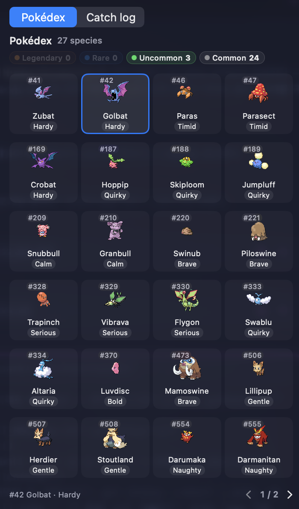
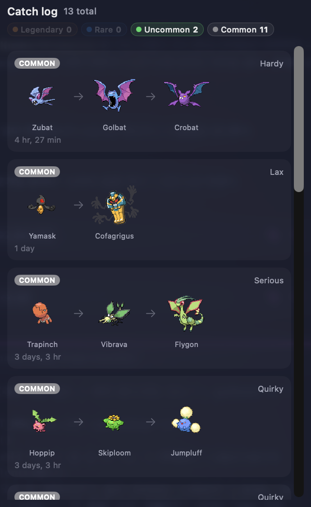

<div align="center">


# PokeTokenBar

**把你的 AI coding token 孵成寶可夢 — 就在選單列上。**

[](https://github.com/chattymin/PokeTokenBar/releases)
[](https://www.apple.com/macos/)
[](https://swift.org)
[](#homebrew)
[](LICENSE)
[](https://github.com/sponsors/chattymin)

[English](README.md) · [한국어](README.ko.md) · [日本語](README.ja.md) · **繁體中文**

</div>

PokeTokenBar 把你本來就在燒的 AI coding token — Claude Code、Codex、Gemini CLI、Antigravity、OpenCode、Hermes Agent、Cursor、Grok CLI、Copilot CLI 與 Kiro CLI — 變成 macOS 選單列上一隻會長大的**寶可夢夥伴**。花 token 孵蛋，沿著真實的進化鏈進化，畢業收進圖鑑，然後從新的蛋重新開始。夥伴底下其實是一個精準的用量追蹤器 — 今日用量、花費，以及官方 5 小時／每週上限，全部直接從你本機的日誌讀取。

> Token 用量直接讀取本機的 Claude Code、Codex、Gemini CLI、Antigravity、OpenCode、Hermes Agent、Cursor、Grok CLI、Copilot CLI 與 Kiro CLI 資料（`totalTokens` = input + output + cache，本地日期）— 不需要任何外部 CLI。本專案為非官方、非商業的寶可夢同人專案 — 請見[授權與免責聲明](#授權與免責聲明)。

## 為什麼要用

- **一個你會想打開的用量追蹤器。** 你的用量在養一隻寶可夢：牠會孵化、進化、畢業，把圖鑑一格一格填滿 — 而每一隻異色都是再打開一次的理由。
- 一眼看完今天的 token 用量與花費 — 不用開儀表板，也不用開瀏覽器分頁。
- 追蹤官方 **5 小時／每週**上限，附重置倒數，以及照目前速度何時會撞上限的預估。

<div align="center">

</div>

## 運作方式

1. 🥚 **照常寫程式。** 你在 Claude Code、Codex、Gemini CLI、Antigravity、OpenCode、Hermes Agent、Cursor、Grok CLI、Copilot CLI 或 Kiro CLI 燒掉的 token 會孵育一顆蛋 — 不用另外執行任何東西。
2. 🐣 **孵化。** 蛋會孵出擁有真實進化鏈的寶可夢，資料來自 [PokéAPI](https://pokeapi.co/) — 第 1～5 世代任一條進化線（329 種可能的起點），依官方 capture rate 加權：一般種常出現，傳說則是 1/129 的大事。孵出後會立刻進入你的**圖鑑**，同時繼續培育。每次孵化都會抽到 25 種性格之一 — 而且偶爾會孵出 **✨ 異色**。
3. ⚡ **進化。** 繼續寫程式，牠就會沿著實際的進化樹成長（1／2／3 階段，含分支），每次進化都有一小段閃光演出。
4. 🎓 **畢業與收藏。** 到達最終進化並跨過門檻後會永久收進**圖鑑** — 越稀有越久（重度使用下，一般種約 3 天 → 傳說約 24 天）— 接著新的蛋就會送到。
5. 🍬 **用滿上限，拿一顆糖。** 把 5 小時或每週用量上限用滿，就能得到**神奇糖果** — 從**背包**拿出來餵給目前的寶可夢。
6. 🛒 **在商店消費。** 你已經用掉的每一個 token 都是可花用的貨幣 — 可以買**神奇糖果**、重抽性格的**薄荷**、永久提升異色機率的**閃耀護符**，或是買一顆蛋放走目前的夥伴重新開始。蛋分三種等級：普通的**寶可夢蛋**、保證孵出罕見以上的**罕見的蛋**，以及保證孵出稀有以上的**稀有的蛋**。

## 功能導覽

<table>
<tr>
<td width="45%" align="center"></td>
<td width="55%" valign="middle">
<h3>🐾 讓牠住在你的桌面上</h3>
把夥伴從選單列移到桌面上，尺寸可從 48px 調到 192px。滑鼠移上去看今日用量，點一下開啟彈出視窗，右鍵叫出選單，想拖到哪就拖到哪 — 上限通知還能以對話泡泡的形式出現在牠頭上。
</td>
</tr>
<tr>
<td width="55%" valign="middle">
<h3>在你的選單列裡</h3>
一隻第五世代的動畫 sprite 就住在今日 token 總量旁邊（精簡格式，例如 <code>200.7M</code>）。可以加上今日花費（<code>$</code>）或官方上限 <code>%</code> — 也可以全部關掉，只留角色。
</td>
<td width="45%" align="center"></td>
</tr>
<tr>
<td width="45%" align="center"></td>
<td width="55%" valign="middle">
<h3>✨ 偶爾一次 — 異色</h3>
孵出的異色會在每一次進化後保留自己的配色 — 選單列、首頁卡片、進化鏈都一樣。圖鑑裡編號旁會有一個 ✨，點該格就會切換成異色配色。還有專屬通知，確保你不會錯過那一刻。
</td>
</tr>
<tr>
<td width="55%" valign="middle">
<h3>值得填滿的圖鑑</h3>
<b>圖鑑</b>把你養過的每個物種收斂成一格 — 每頁 24 格，依圖鑑編號排序，擁有異色的會標上 ✨。<b>捕捉紀錄</b>則保留每一隻個體：由新到舊，各自附上完整進化鏈、稀有度、性格與捕捉日期。
</td>
<td width="45%" align="center"><br><br></td>
</tr>
<tr>
<td width="45%" align="center"></td>
<td width="55%" valign="middle">
<h3>調成你喜歡的樣子</h3>
選單列顯示項目、更新間隔（1–15 分鐘或手動）、登入時自動啟動、只隱藏上限區塊的 Keychain 關閉選項、含警告／危急門檻的上限通知，以及夥伴事件通知。完整的 <b>KO／EN／JA／ES／ZH-Hant</b> 介面與寶可夢名稱。
</td>
</tr>
<tr>
<td width="55%" valign="middle">
<h3>🍬 用滿上限，賺一顆神奇糖果</h3>
把 5 小時或每週用量上限用滿，就會拿到一顆<b>神奇糖果</b> — 每個 5 小時區間一顆，每週上限五顆。從新的<b>背包</b>分頁拿出來餵給目前的寶可夢：被限流的那一刻，正好變成你升級的那一刻。
</td>
<td width="45%" align="center"></td>
</tr>
<tr>
<td width="45%" align="center"></td>
<td width="55%" valign="middle">
<h3>🛒 靠你的用量運轉的商店</h3>
你已經用掉的 token 就是貨幣。在新的<b>商店</b>分頁裡，可以換<b>神奇糖果</b>培育目前的寶可夢、用<b>薄荷</b>重抽性格、買永久提升異色孵化機率的<b>閃耀護符</b>，或是買一顆蛋放走夥伴重新開始。蛋分三種等級 — 普通的<b>寶可夢蛋</b>、必定孵出罕見以上的<b>罕見的蛋</b>，以及必定孵出稀有以上的<b>稀有的蛋</b>。兩種高級蛋的抽選池都仍保留傳說，所以保底的蛋照樣可能給你驚喜。
</td>
</tr>
</table>

## 還有這些

- **可互動的浮動寵物** — 滑鼠移上去看今日用量，點一下開主視窗，右鍵叫出選單；上限通知可以用對話泡泡彈出。
- **各服務分頁** — 偵測到 Claude Code、Codex、Gemini CLI、Antigravity、OpenCode、Hermes Agent、Cursor、Grok CLI、Copilot CLI、Kiro CLI 其中兩個以上時，會出現精簡分頁切換；今日總計仍然是合併的。
- **官方上限** — Claude 與 Codex 的 5 小時／每週使用率與重置倒數，就在今日數字下方。
- **消耗速度預估** — 推算目前 5 小時區間何時會到 100%。
- **App 內更新** — 一鍵檢查更新；目前版本顯示在設定裡。

## 支援的工具

| 工具 | 追蹤範圍 | 官方上限 |
|---|---|---|
| **Claude Code** | 今日 · 5 小時區間 · 週 · 月 | ✅ 5 小時／每週 |
| **Codex** | 今日 · 週 · 月 | ✅ 5 小時／每週 |
| **Gemini CLI** | 今日 · 週 · 月 | — |
| **Antigravity** | 今日 · 5 小時區間 · 週 · 月 | — |
| **OpenCode** | 今日 · 5 小時區間 · 週 · 月 | — |
| **Hermes Agent** | 今日 · 5 小時區間 · 週 · 月 | — |
| **Cursor** | 今日 · 5 小時區間 · 週 · 月 | — |
| **Grok CLI** | 今日 · 5 小時區間 · 週 · 月 | — |
| **Copilot CLI** | 今日 · 5 小時區間 · 週 · 月 | — |
| **Kiro CLI** | 今日 · 5 小時區間 · 週 · 月 | —（推估） |

全部都在本機讀取 — 不需要外部用量 CLI。要新增一個工具只需要一個 provider 檔案（見 [CONTRIBUTING.md](CONTRIBUTING.md)）。

## 安裝

### 系統需求

macOS 14 以上（Apple Silicon 或 Intel）。就這樣 — token 用量直接從本機的 Claude Code、Codex、Gemini CLI、Antigravity、OpenCode、Hermes Agent、Cursor、Grok CLI、Copilot CLI 與 Kiro CLI 資料讀取，不需要任何外部用量 CLI。

### Homebrew

```bash
brew install --cask chattymin/tap/poke-token-bar
```

採 ad-hoc／自簽章；cask 會在安裝時移除 quarantine 屬性。

### 手動安裝（不使用 Homebrew）

不想用 Homebrew？從[最新 release](https://github.com/chattymin/PokeTokenBar/releases/latest) 下載 `PokeTokenBar.zip`，解壓縮後把 `PokeTokenBar.app` 拖進 `/Applications`。

因為這個 App 是 ad-hoc／自簽章（沒有用 Apple Developer 帳號公證），Gatekeeper 首次啟動時會顯示「無法辨識的開發者」警告。用以下任一方式處理一次即可：

- **Finder：** 對 `PokeTokenBar.app` 按右鍵（或 Control-click）→ **打開** → 在對話框中再按一次 **打開**。
- **終端機：** `xattr -dr com.apple.quarantine /Applications/PokeTokenBar.app`

（Homebrew cask 會幫你移除 quarantine，所以不需要這一步。）

### 從原始碼建置

```bash
swift build                  # debug
swift test                   # 單元測試
./scripts/build-app.sh       # release → PokeTokenBar.app → /Applications
```

## 資料來源

| 來源 | 用途 | 說明 |
|---|---|---|
| `~/.claude/projects/**/*.jsonl` | Claude Code 每日／區間／每週／每月 | 直接讀取；以 message id 去重；增量快取 |
| `~/.gemini/tmp/**/chats/*.json(l)` | Gemini CLI 每日／每月 | session 紀錄（每則訊息的 `tokens`）；每週 = 每日加總 |
| `~/.gemini/antigravity-cli/conversations/*.db` | Antigravity 每日／區間／每週／每月 | SQLite 唯讀；從 Cascade protobuf blob 取得每次呼叫的用量；獨立 provider，不併入 Gemini；訂閱制，因此不估算費用 |
| `~/.codex/sessions/**/*.jsonl` | Codex 每日／每月 | `token_count` 事件；每週 = 每日加總 |
| `~/.local/share/opencode/opencode.db` | OpenCode 每日／區間／每週／每月 | SQLite 唯讀；也支援舊版 `storage/message` JSON |
| `~/.hermes/state.db` | Hermes Agent 每日／區間／每週／每月 | SQLite 唯讀；session token 總計與已保存的費用 |
| `~/Library/Application Support/Cursor/User/globalStorage/state.vscdb` | Cursor 每日／區間／每週／每月 | SQLite 唯讀；`cursorDiskKV` 中帶 `tokenCount` 的 bubble 項目 |
| `~/.grok/sessions/**/updates.jsonl` | Grok CLI 每日／區間／每週／每月 | `turn_completed` 紀錄（每回合的 `usage`，伺服器回報的費用）；支援 `$GROK_HOME`；subagent session 會略過，因為其 token 已併入父回合 |
| `~/.copilot/session-store.db` | Copilot CLI 每日／區間／每週／每月 | SQLite 唯讀；每次 API 呼叫一列 `assistant_usage_events`；支援 `$COPILOT_HOME`；`input_tokens` 已包含快取的 prompt，所以會扣掉 cache 讀寫；採 premium request 計費，因此不估算費用 |
| `~/Library/Application Support/kiro-cli/data.sqlite3` | Kiro CLI 每日／區間／每週／每月 | SQLite 唯讀；對話歷史 JSON（`conversations`／`conversations_v2`）；Kiro 的本機資料庫從不記錄真實 token 數，也沒有伺服器端 session，所以 input 是把每回合重送的累積對話文字用 bytes÷4 做的**推估**（output 同樣取自實際串流回應大小）；被 `/clear` 或壓縮過的對話，其已計入的 token 會維持計入直到 App 重啟；不估算費用 |
| Keychain／`~/.claude/.credentials.json` → `api.anthropic.com` | Claude 官方 5 小時／每週 % | 非官方端點；Keychain **只有在你按下更新時**才會讀取 — 自動輪詢永遠不讀 |
| `codex app-server` | Codex 官方 5 小時／每週 % | 本機子行程；只取帳號快照，不會進行模型推論 |
| [PokéAPI](https://pokeapi.co/) — `pokeapi.co`、`graphql.pokeapi.co` | 寶可夢物種與進化資料 | 執行期抓取；本機快取，絕不內建 |
| `raw.githubusercontent.com/PokeAPI/sprites` | 寶可夢與道具 sprite | 執行期抓取；快取在 Application Support 下，絕不內建 |
| `status.claude.com`、`status.openai.com` | 服務異常橫幅 | statuspage 摘要；僅供顯示 — 可在設定中關閉 |
| `api.github.com` | 更新檢查 | 最新 release tag；啟動時與開啟彈出視窗時檢查 |

## 隱私與權限

- **在裝置上處理。** Token 用量直接從本機的 Claude Code、Codex、Gemini CLI、Antigravity、OpenCode、Hermes Agent、Cursor、Grok CLI、Copilot CLI 與 Kiro CLI 資料讀取。App 從不上傳用量，也不會執行模型推論。
- **對外連線。** 這個 App 並非完全離線。它會連向七個主機：`pokeapi.co` 與 `graphql.pokeapi.co`（物種／進化）、`raw.githubusercontent.com`（sprite）、`api.anthropic.com`（Claude 官方上限）、`status.claude.com` 與 `status.openai.com`（異常橫幅 — 設定裡可關閉），以及 `api.github.com`（更新檢查）。**這些連線都不會帶上你的用量、token、prompt 或專案路徑** — 只有請求本身。
- **Keychain（選用）。** Claude 的 OAuth 憑證**只有在你按下更新按鈕時**（設定裡，或彈出視窗的上限那一列）才會讀取。自動輪詢永遠不碰 Keychain，所以不會跳出密碼視窗；若 `~/.claude/.credentials.json` 可用，則改從該檔案取得。Token 只保存在記憶體中 — App 不會自己建立任何 Keychain 項目。Token 過期後，上限仍會顯示但停留在舊值，直到你手動更新。也可以在設定裡直接關閉 — 上限區塊就只是隱藏起來。
- **寶可夢素材**是在執行期從 PokéAPI 抓取，且只快取在 `~/Library/Application Support/PokeTokenBar/` 底下。App 執行檔與其 release 產物都不含任何寶可夢素材。

## 貢獻者

歡迎任何規模的貢獻 — 建置、測試與發 pull request 的方式請見 [CONTRIBUTING.md](CONTRIBUTING.md)。

[](https://github.com/chattymin/PokeTokenBar/graphs/contributors)

## 授權與免責聲明

**MIT** — 見 [LICENSE](LICENSE)。MIT 授權只涵蓋本專案的原創原始碼；不授予任何第三方商標、美術素材，或透過本 App 取得之資料的任何權利。

PokeTokenBar 是一個**非官方、非商業的同人專案**，**與任天堂、Game Freak、Creatures Inc. 或寶可夢公司均無隸屬關係，亦未獲其背書、贊助或核准。**「寶可夢／Pokémon」及所有相關名稱、角色與圖像均為其各自權利人之商標與著作權。本專案不主張擁有、也不主張對任何寶可夢智慧財產權的任何權利。

- **App 執行檔與其 release 產物不內建任何寶可夢素材。** 寶可夢物種資料與 sprite 是在**執行期**從公開的 [PokéAPI](https://pokeapi.co) 抓取，並快取在使用者自己的裝置上；經由 PokéAPI 提供的 sprite 圖像，其權利仍屬各自權利人所有。
- 本 repo 文件中出現的任何寶可夢圖像（螢幕截圖／GIF），純粹用於說明 App 的功能。
- 本 App 免費提供，僅供**個人、非商業用途使用。**
- 若您是權利人且對本專案有任何疑慮，請開 issue 或聯絡維護者，我們會盡快回覆。

*本軟體以「現狀」提供，不附任何形式的擔保。本聲明不構成法律意見。*
